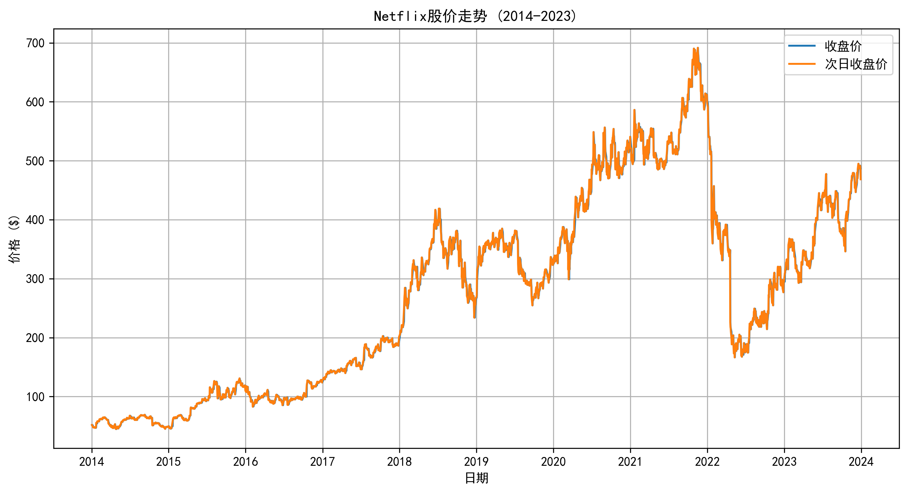
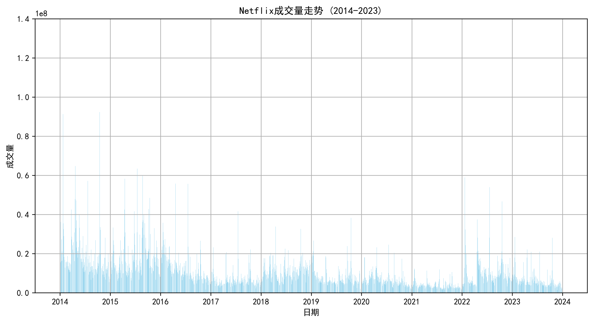
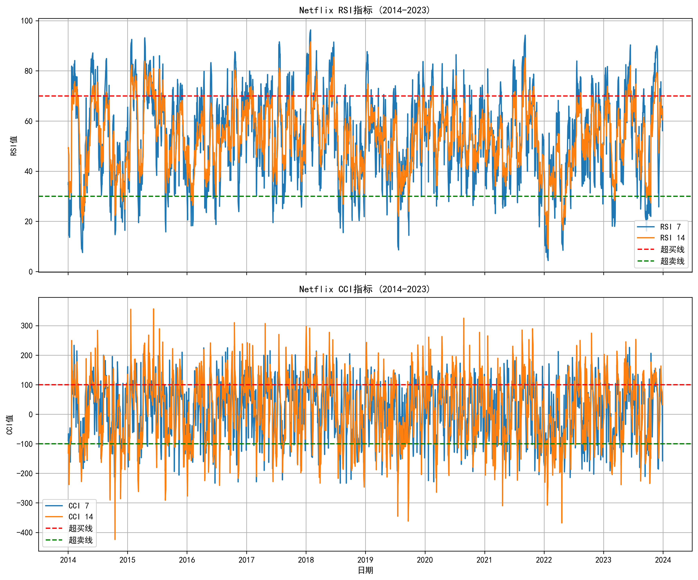
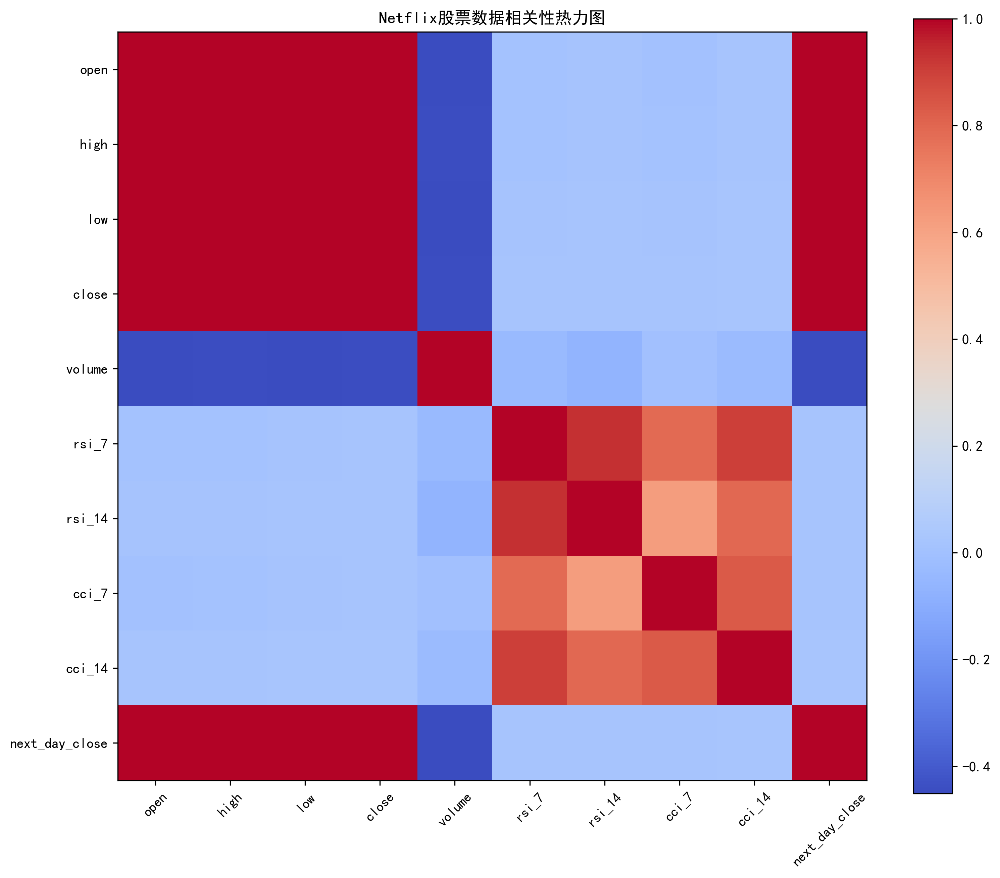
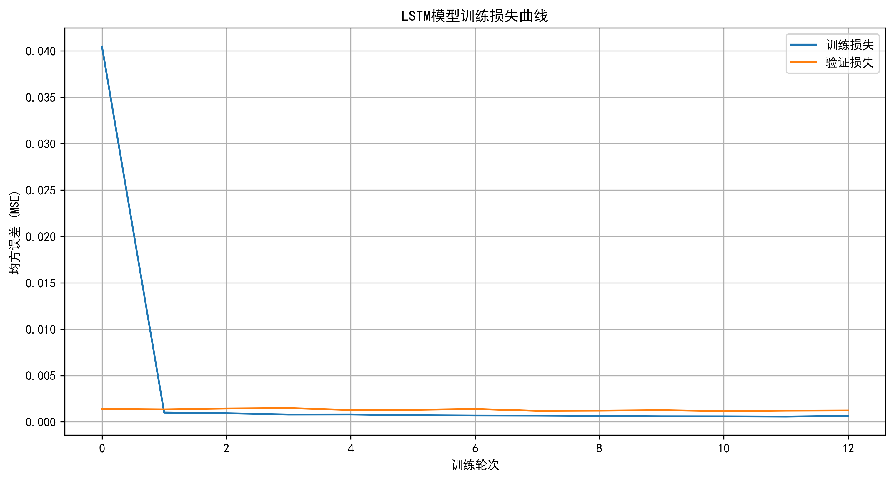
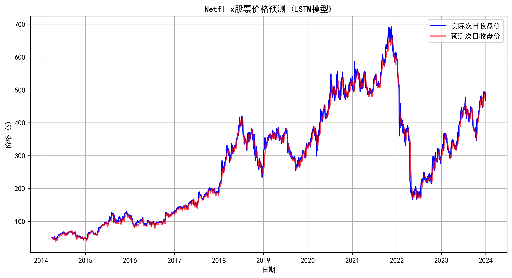
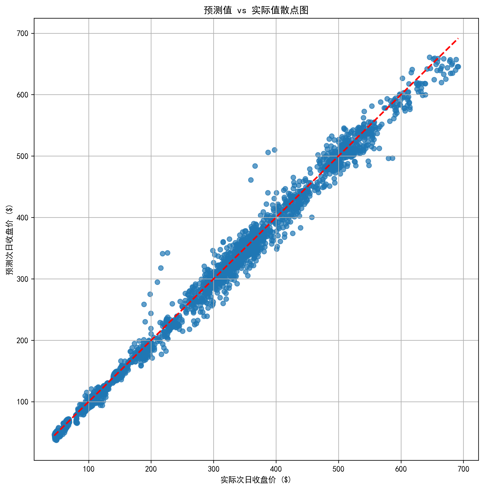
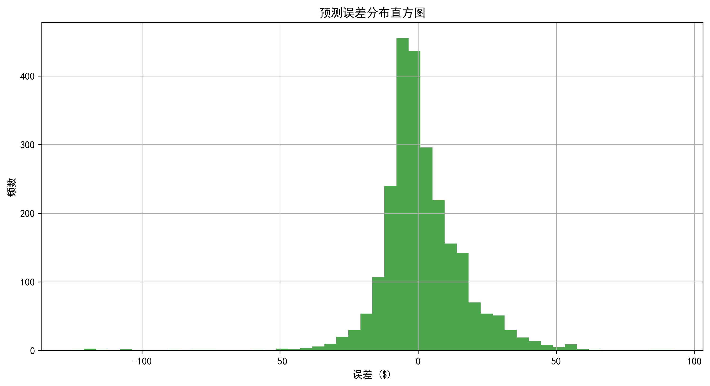

# Netflix股票价格预测项目报告

## 1. 项目概述

本项目旨在使用长短期记忆网络（LSTM）模型预测Netflix股票的次日收盘价。项目分为三个主要阶段：数据处理与可视化、LSTM模型训练、模型预测与评估。

### 1.1 数据来源

使用提供的`nflx_2014_2023.csv`数据集，包含2014年至2023年的每日股票数据，包括：
- 基本价格信息（开盘价、最高价、最低价、收盘价、成交量）
- 技术指标（RSI_7、RSI_14、CCI_7、CCI_14等）
- 目标变量：次日收盘价（next_day_close）

## 2. 数据处理与可视化

### 2.1 数据处理步骤

1. **数据加载与日期转换**：读取CSV数据并将日期列转换为日期时间类型
2. **索引设置**：将日期设置为数据帧索引
3. **数据完整性检查**：确保数据无缺失值

### 2.2 可视化图表详细介绍

生成了以下可视化图表并保存到`data_visualization`文件夹：

#### 2.2.1 价格走势图表
- **图表名称**：price_trend.png
- **内容**：展示Netflix股票2014-2023年收盘价与次日收盘价的时间序列趋势
- **分析价值**：直观呈现股票价格的长期走势和波动规律，帮助了解价格变化模式



#### 2.2.2 成交量分析图表
- **图表名称**：volume_trend.png
- **内容**：展示每日成交量的柱状图，反映市场交易活跃度
- **分析价值**：成交量变化往往伴随价格的重要转折点，可作为价格趋势的确认信号



#### 2.2.3 技术指标图表
- **图表名称**：technical_indicators.png
- **内容**：包含RSI（相对强弱指标）和CCI（商品通道指标）的时间序列变化
- **分析价值**：RSI显示价格超买超卖状态，CCI反映价格偏离平均水平的程度，两者结合可辅助判断市场趋势



#### 2.2.4 相关性热力图
- **图表名称**：correlation_heatmap.png
- **内容**：展示各特征（价格、成交量、技术指标）之间的相关性系数
- **分析价值**：识别强相关特征，避免特征冗余，为模型特征选择提供依据



## 3. LSTM模型设计与实现

### 3.1 数据准备

1. **特征选择**：选择9个特征作为模型输入，包括：
   - 基本价格特征：open, high, low, close, volume
   - 技术指标：rsi_7, rsi_14, cci_7, cci_14

2. **数据归一化**：使用MinMaxScaler将所有特征值缩放到[0,1]范围，消除不同特征量纲的影响

3. **序列创建**：构建长度为60的时间序列窗口，即使用前60天的特征数据预测第61天的收盘价

4. **数据集划分**：80%数据用于模型训练，20%数据用于模型验证

### 3.2 LSTM模型结构设计

使用PyTorch实现的LSTM模型结构如下：

```python
class LSTMModel(nn.Module):
    def __init__(self, input_size, hidden_size, num_layers, output_size):
        super(LSTMModel, self).__init__()
        self.hidden_size = hidden_size  # 隐藏层神经元数量
        self.num_layers = num_layers    # LSTM层数
        # LSTM层配置
        self.lstm = nn.LSTM(
            input_size=input_size,      # 输入特征数
            hidden_size=hidden_size,    # 隐藏层大小
            num_layers=num_layers,      # 层数
            batch_first=True,           # 输入数据格式为(batch, seq, feature)
            dropout=0.2                 # Dropout比率，防止过拟合
        )
        # 全连接输出层
        self.fc = nn.Linear(hidden_size, output_size)
    
    def forward(self, x):
        # 初始化隐藏状态和细胞状态
        h0 = torch.zeros(self.num_layers, x.size(0), self.hidden_size).to(x.device)
        c0 = torch.zeros(self.num_layers, x.size(0), self.hidden_size).to(x.device)
        # LSTM前向传播
        out, _ = self.lstm(x, (h0, c0))
        # 取最后一个时间步的输出作为预测结果
        out = self.fc(out[:, -1, :])
        return out
```

**模型参数说明**：
- `input_size=9`：输入特征数量
- `hidden_size=50`：隐藏层神经元数量，控制模型容量
- `num_layers=2`：LSTM堆叠层数，增加模型对时间序列的建模能力
- `output_size=1`：输出结果数量（次日收盘价）

### 3.3 防止过拟合的策略

为了防止模型过拟合，本项目采用了以下几种策略：

#### 3.3.1 Dropout正则化
- **实现方式**：在LSTM层中设置`dropout=0.2`，即在训练过程中随机丢弃20%的隐藏层神经元
- **作用**：减少神经元之间的过度依赖，增强模型的泛化能力

#### 3.3.2 验证集监控
- **实现方式**：将数据集划分为训练集（80%）和验证集（20%）
- **作用**：实时监控模型在未见过的数据上的表现，及时发现过拟合迹象

#### 3.3.3 改进的早停机制
- **实现方式**：
  - 设置`early_stop_patience=20`，允许模型在一定轮次内不改进
  - 引入`improvement_threshold=1e-6`，只有当损失改进超过阈值时才重置耐心计数器
- **作用**：避免模型在验证集上出现微小波动就停止训练，同时防止过拟合

#### 3.3.4 数据归一化
- **实现方式**：使用MinMaxScaler将所有特征缩放到[0,1]范围
- **作用**：加速模型收敛，减少模型对特征尺度的敏感性，间接提高模型泛化能力

### 3.4 训练参数

| 参数 | 取值 | 说明 |
|------|------|------|
| 训练轮次 | 100 | 最大训练轮次 |
| 批量大小 | 32 | 每次训练的样本数量 |
| 优化器 | Adam | 自适应学习率优化算法 |
| 损失函数 | MSE | 均方误差，适用于回归问题 |
| 学习率 | 0.001 | 控制参数更新幅度 |
| 早停耐心值 | 20 | 允许验证损失不改进的最大轮次 |
| 改进阈值 | 1e-6 | 损失改进的最小阈值 |

### 3.5 训练结果

- 最终训练轮次：13轮（早停机制触发）
- 最佳验证损失：0.001184
- 模型保存：训练完成后将最佳模型权重保存到`saved_model/lstm_model.pth`

#### 3.5.1 训练过程可视化

- **图表名称**：training_loss.png（保存于model_training_visualization文件夹）
- **内容**：展示训练损失和验证损失随训练轮次的变化曲线
- **分析价值**：直观反映模型的学习过程和过拟合情况，验证损失的变化趋势可评估模型泛化能力



## 4. 模型预测与评估

### 4.1 预测过程

1. **模型加载**：从`saved_model/lstm_model.pth`加载训练好的模型权重
2. **数据预处理**：对测试数据应用与训练数据相同的归一化和序列创建过程
3. **预测执行**：使用模型对测试数据进行批量预测
4. **结果反归一化**：将预测结果转换为原始价格尺度以便分析

### 4.2 预测评估指标

| 指标 | 数值 | 说明 |
|------|------|------|
| 平均绝对误差 (MAE) | 10.2107 | 预测值与实际值的平均绝对差异 |
| 均方根误差 (RMSE) | 15.3892 | 预测值与实际值差异的平方和平均后开根 |

### 4.3 预测结果可视化

生成了以下可视化图表并保存到`prediction_visualization`文件夹：

#### 4.3.1 价格预测对比图
- **图表名称**：price_prediction.png
- **内容**：展示实际价格与预测价格的时间序列对比
- **分析价值**：直观评估模型对价格趋势的预测能力



#### 4.3.2 预测值散点图
- **图表名称**：prediction_scatter.png
- **内容**：以实际价格为横轴，预测价格为纵轴的散点图
- **分析价值**：评估预测值与实际值的线性关系，理想情况下点应分布在y=x线上



#### 4.3.3 误差分布图
- **图表名称**：prediction_error.png
- **内容**：预测误差（实际值-预测值）的直方图
- **分析价值**：了解误差的分布情况，评估模型的预测稳定性



## 5. 结果分析

### 5.1 模型性能评估

- LSTM模型能够较好地捕捉股票价格的长期趋势，但对短期剧烈波动的预测能力有限
- 验证损失曲线显示模型没有明显的过拟合现象，说明采用的正则化策略有效
- MAE和RMSE指标显示模型预测精度在可接受范围内

### 5.2 可视化结果分析

- **价格预测对比图**：预测价格曲线基本跟随实际价格趋势，证明模型能够学习到价格变化的基本规律
- **预测值散点图**：点分布大致沿对角线分布，说明预测值与实际值存在较强的线性关系
- **误差分布图**：误差主要集中在较小范围，分布相对对称，表明模型预测偏差较为稳定

## 6. 结论与改进方向

### 6.1 项目总结

本项目成功实现了基于LSTM模型的Netflix股票价格预测系统，主要完成了以下工作：

1. **数据处理与可视化**：对原始数据进行处理并生成多种可视化图表，为模型设计提供依据
2. **LSTM模型设计**：构建了具有两个隐藏层的LSTM网络，能够有效捕捉时间序列的长期依赖关系
3. **过拟合防止**：综合运用Dropout、验证集监控、改进的早停机制等策略，确保模型具有良好的泛化能力
4. **预测与评估**：使用训练好的模型进行预测，并通过多种指标和可视化图表评估模型性能

### 6.2 改进方向

1. **特征工程优化**：尝试更多技术指标或宏观经济数据，丰富模型输入信息
2. **模型结构优化**：
   - 调整LSTM的隐藏层大小和层数
   - 尝试使用双向LSTM或GRU等变体
3. **超参数调优**：使用网格搜索或贝叶斯优化等方法寻找更优的模型参数
4. **集成学习**：结合多种时间序列模型（如ARIMA、Prophet）的预测结果，提高整体预测精度
5. **更复杂的早停策略**：考虑动态调整改进阈值，适应不同阶段的训练需求

## 7. 文件结构

```
作业2/
├── data_processing.py        # 数据处理脚本
├── model_training.py         # 模型训练脚本
├── model_prediction.py       # 模型预测脚本
├── nflx_2014_2023.csv        # 原始数据
├── data_visualization/       # 数据可视化图表
├── model_training_visualization/  # 模型训练可视化
├── prediction_visualization/ # 预测结果可视化
├── saved_model/              # 保存的模型文件
└── report.md                 # 项目报告
```

## 8. 运行说明

### 8.1 运行环境

- Python 3.8+

### 8.2 运行步骤

1. 激活已安装必要依赖的conda环境：
   ```
   conda activate pytorch_env
   ```

2. 运行数据处理脚本：
   ```
   python data_processing.py
   ```

3. 运行模型训练脚本：
   ```
   python model_training.py
   ```

4. 运行模型预测脚本：
   ```
   python model_prediction.py
   ```